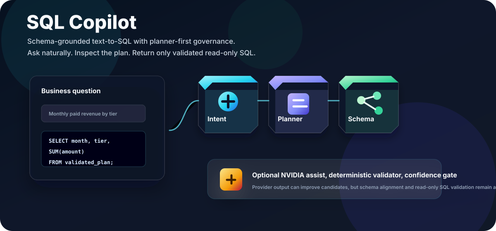
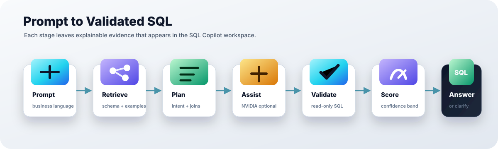
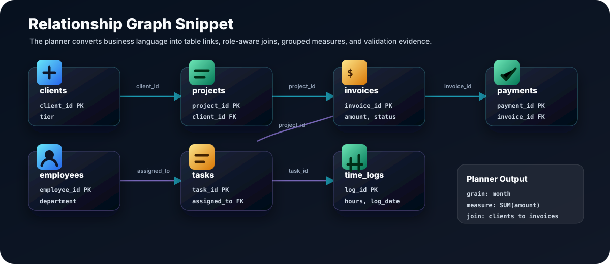
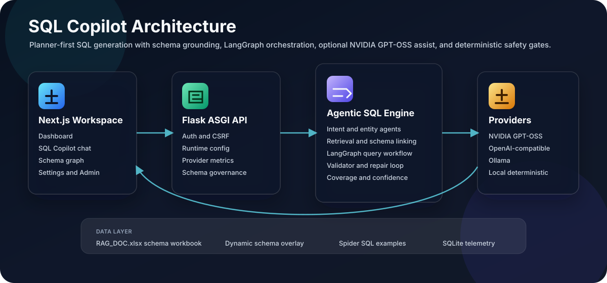
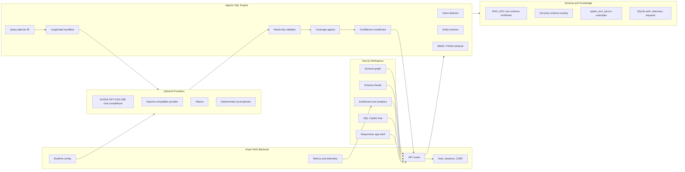
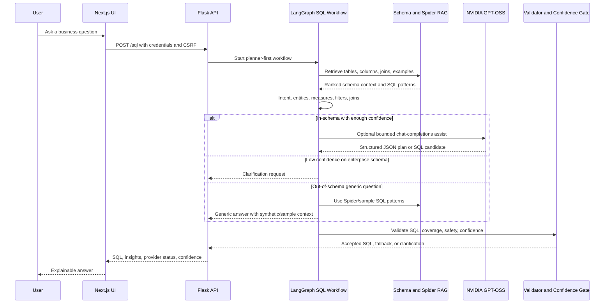
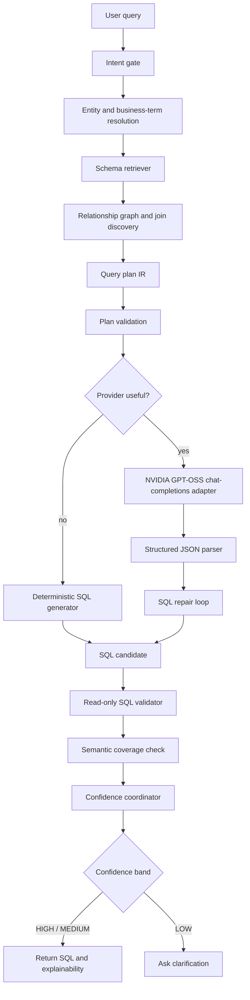

# SQL Copilot

<p align="center">
  <strong>Enterprise SQL Copilot for planned, governed, and explainable text-to-SQL.</strong>
</p>

<p align="center">
  SQL Copilot turns business questions into schema-grounded, read-only SQL through deterministic planning, LangGraph orchestration, optional NVIDIA GPT-OSS assistance, validation, confidence gating, and a polished enterprise workspace.
</p>

<p align="center">
  <a href="https://sql-copilot-puce.vercel.app">
    
  </a>
  
  
  
  
  
</p>

<p align="center">
  
</p>

## What It Does

SQL Copilot is built for teams that need controlled SQL generation instead of a raw prompt-to-query box. It understands a workbook-backed enterprise schema, resolves business intent, builds a query plan, optionally asks a remote chat model for assistance, validates the result, and explains why the final SQL should be trusted or why clarification is needed.

| Need | SQL Copilot behavior |
| --- | --- |
| Natural-language analytics | Detects intent, entities, measures, dimensions, filters, time ranges, and grouping requirements before SQL is generated. |
| Schema grounding | Links user language to known tables, columns, foreign keys, business descriptions, dynamic schema additions, and sample Spider SQL patterns. |
| Governed model use | NVIDIA GPT-OSS is optional and receives bounded schema/query-plan context only after deterministic planning. |
| Low-confidence handling | In-schema but ambiguous requests ask for clarification instead of fabricating SQL. |
| Out-of-schema questions | The assistant can provide generic SQL guidance using the Spider RAG corpus and synthetic examples without pretending the enterprise schema contains missing tables. |
| Safety | Only one read-only `SELECT` statement is accepted; write, DDL, privilege, and execution operations are blocked. |
| Explainability | Planner steps, join path, validation, coverage, provider status, fallback reason, confidence signals, and optimization guidance are visible in the UI. |

## Product Surface

The workspace is designed as an operational SQL assistant, not a marketing dashboard. The UI favors compact data density, consistent headers, readable cards, and clear task flows.

| Area | Purpose |
| --- | --- |
| Dashboard | Provider health, LLM success/fallback rate, planner accuracy, SQL accuracy, validator precision, confidence reliability, recent activity, range filters, analytics, schema health, and relationship graph modal. |
| SQL Copilot | Natural-language prompt, SQL answer, generic guidance, deterministic fallback visibility, provider status, history, export, and explainability. |
| Schema Explorer | Table and column search, domain filtering, relationships, and join recommendations. |
| Schema Graph | React Flow relationship graph with zoom, pan, minimap, and animated join edges. |
| Data Model Studio | Governed schema requests, upload inference, live metadata refresh, proposal promotion, and dynamic table management. |
| Planner | Intent-to-SQL execution path with table selection, joins, aggregations, filters, validation, and confidence nodes. |
| Optimizer | SQL rewrite suggestions, warnings, indexes, cost hints, and risk review. |
| Settings | Runtime provider configuration, NVIDIA status, email configuration, security state, and environment diagnostics. |
| Admin Review | Schema request governance, generated proposal apply action, feedback queue, and audit-friendly review flow. |

## Visual Workflow

<p align="center">
  
</p>

The core product flow is intentionally visible in the interface: the user asks a question, the backend retrieves schema context, the planner builds a join-aware query plan, optional NVIDIA assist improves the SQL candidate, and deterministic guards decide whether to answer or ask for clarification.

<p align="center">
  
</p>

### Sample Flow

```text
User asks
  "Show monthly invoice revenue by client tier for paid invoices."

Planner extracts
  intent: aggregate revenue
  measure: invoices.amount
  time grain: month
  dimension: clients.tier
  filter: invoices.status = 'paid'
  join path: clients -> projects -> invoices

Validated SQL
  SELECT
    DATE_TRUNC('month', invoices.invoice_date) AS invoice_month,
    clients.tier,
    SUM(invoices.amount) AS revenue
  FROM clients
  JOIN projects ON projects.client_id = clients.client_id
  JOIN invoices ON invoices.project_id = projects.project_id
  WHERE invoices.status = 'paid'
  GROUP BY invoice_month, clients.tier
  ORDER BY invoice_month, clients.tier;
```

## Architecture Overview

<p align="center">
  
</p>



## Query Workflow



## Agent Workflow

The model is not the first planner. SQL Copilot uses deterministic and graph-based agents first, then allows provider assistance only inside the validated boundary.



## Design System

SQL Copilot uses a restrained enterprise design language:

- 3D icon treatment through `frontend/components/ui/icon-3d.tsx`, backed by recognizable `lucide-react` symbols.
- Compact dashboard cards with clear labels, values, helpers, and click-through detail modals.
- A cleaner top navigation with global search, command access, theme toggle, account controls, and an interactive Jump menu.
- Persistent desktop sidebar with page-specific icons and light/dark hover contrast fixes.
- Theme-aware shared primitives for cards, badges, buttons, inputs, modals, and app shell surfaces.
- Data visualization with Recharts for usage and quality trends, plus React Flow for schema and planner graphs.

## Backend Internals

The backend is a Flask application exported through ASGI for Uvicorn. It owns authentication, session security, schema loading, SQL orchestration, provider configuration, telemetry, and runtime path management.

```text
backend/
  app.py                       API routes, auth middleware, SQL orchestration, metrics
  auth.py                      users, sessions, resets, feedback, structured logs
  llm_providers.py             NVIDIA, custom OpenAI-compatible, Ollama, local fallback
  runtime_config.py            relocatable runtime, cache, SQLite, model paths
  spider_rag.py                Spider SQL example retrieval for generic guidance
  synthetic_enterprise_data.py enterprise catalog and schema proposals
  data/RAG_DOC.xlsx            default workbook-backed schema source
```

Important backend boundaries:

- Browser clients use HTTP-only cookies and CSRF headers.
- CORS is credentialed and restricted to configured frontend origins.
- Admin routes require `role=admin` even when the UI hides admin pages.
- Runtime secrets are kept server-side and are not returned to the frontend.
- Generated databases, FAISS indexes, logs, reports, and provider env files live under the runtime directory.

## Frontend Internals

The frontend is a Next.js 15 App Router application with React 19 and TypeScript.

```text
frontend/
  app/                    public auth routes and protected workspace pages
  components/app-shell/   sidebar, topbar, page header, command palette
  components/copilot/     chat workspace and explainability panel
  components/dashboard/   analytics chart and dashboard UI
  components/schema/      relationship graph views
  components/ui/          shared design primitives
  features/api/           typed credentialed API client
  features/auth/          session provider
  features/store/         persistent UI and Copilot state
```

State ownership:

| State | Owner |
| --- | --- |
| API data | TanStack Query |
| Authenticated user | AuthProvider and `/auth/me` |
| Sidebar, theme, history, active response | Zustand persisted UI store |
| Route protection | Next.js middleware plus backend session validation |
| SQL request credentials | `credentials: include` with CSRF header on unsafe methods |

## Data And Retrieval

SQL Copilot combines three knowledge sources:

| Source | Role |
| --- | --- |
| `backend/data/RAG_DOC.xlsx` | Primary schema workbook with table, column, datatype, description, and table purpose metadata. |
| Dynamic schema overlay | Live Schema Studio changes persisted outside the workbook and loaded without backend restart. |
| `spider_text_sql.csv` | SQL pattern corpus for out-of-schema generic guidance and sample SQL reasoning. |

Retrieval uses BM25 immediately and FAISS when embeddings are configured. Schema Studio refreshes table maps, relationship maps, Mermaid ER output, planner hints, retrieval documents, FAISS indexes, and cached copilot instances after live changes.

## NVIDIA GPT-OSS Provider

NVIDIA is supported as an optional server-side chat-completions provider.

```dotenv
SQL_COPILOT_LLM_PROVIDER=nvidia
NVIDIA_API_KEY=
NVIDIA_MODEL=openai/gpt-oss-20b
NVIDIA_BASE_URL=https://integrate.api.nvidia.com/v1
LLM_TIMEOUT_SECONDS=30
LLM_MAX_RETRIES=2
LLM_TEMPERATURE=0
MAX_GENERATION_RETRIES=3
```

The adapter uses the OpenAI-compatible client against NVIDIA's base URL:

```python
OpenAI(base_url="https://integrate.api.nvidia.com/v1", api_key=os.environ["NVIDIA_API_KEY"])
```

Provider output must be structured JSON and still passes deterministic validation. Missing keys, timeouts, rate limits, network failures, invalid output, and provider unavailability all fall back to the deterministic SQL path.

## Safety And Confidence

SQL Copilot uses hard gates before returning SQL:

| Gate | Behavior |
| --- | --- |
| Intent gate | Separates SQL tasks, clarification cases, and generic guidance. |
| Plan validation | Checks known tables, columns, relationships, joins, filters, aggregates, and graph connectivity. |
| SQL validator | Allows one read-only `SELECT`; blocks write, DDL, execution, and privilege commands. |
| Coverage agents | Compare generated SQL against requested entities, measures, dimensions, joins, and filters. |
| Confidence coordinator | Combines intent, entity, column, join, aggregation, semantic, validation, planner, and model signals. |
| Clarification policy | Low confidence on real schema asks for clarification instead of guessing. |

## Runtime Layout

The project is designed to run cleanly from `D:\Projects\EnterpriseSQLCopilot`, with generated data separated from source code.

```text
.runtime/
  cache/          retrieval and process caches
  sqlite/         auth, sessions, schema requests, telemetry
  logs/           API, provider, planner, frontend diagnostics
  secrets/        runtime provider and email env files
  dynamic_schema.json
```

For machines with limited C-drive space:

```powershell
.\scripts\prepare_d_drive.ps1 -CopyProject
cd D:\Projects\EnterpriseSQLCopilot
```

## Quick Start

Backend:

```powershell
python -m venv venv
venv\Scripts\Activate.ps1
pip install -r backend\requirements.txt
python -m uvicorn main:asgi_app --host 127.0.0.1 --port 5000
```

Frontend:

```powershell
cd frontend
npm install
npm run dev
```

Open:

```text
http://127.0.0.1:4000
```

Create an account at `/signup`. To bootstrap an administrator, set these before starting the backend:

```powershell
$env:BOOTSTRAP_ADMIN_NAME="SQL Copilot Admin"
$env:BOOTSTRAP_ADMIN_EMAIL="admin@example.com"
$env:BOOTSTRAP_ADMIN_PASSWORD="ChangeThis1!"
```

## Configuration Map

| Variable | Purpose |
| --- | --- |
| `NEXT_PUBLIC_API_BASE_URL` | Frontend API base URL. |
| `FRONTEND_ORIGIN` / `FRONTEND_ORIGINS` | Credentialed CORS allowlist. |
| `APP_ENV` | Development or production behavior. |
| `AUTH_DB_PATH` | SQLite auth, sessions, feedback, logs. |
| `AUTH_JWT_SECRET` | Managed JWT signing secret for production. |
| `SCHEMA_FILE` | Workbook schema source. |
| `DYNAMIC_SCHEMA_FILE` | Live Schema Studio overlay. |
| `SQL_COPILOT_RUNTIME_DIR` | Generated runtime directory. |
| `SQL_COPILOT_CACHE_DIR` | Retrieval and process cache root. |
| `SQL_COPILOT_SQLITE_DIR` | SQLite database root. |
| `SQL_COPILOT_LOG_DIR` | Runtime log root. |
| `SQL_COPILOT_MODEL_DIR` | Optional model/checkpoint root. |
| `SQL_COPILOT_LLM_PROVIDER` | `nvidia`, `openai`, `ollama`, or `local`. |
| `NVIDIA_API_KEY` | Server-side NVIDIA credential. |
| `NVIDIA_MODEL` | NVIDIA chat model name. |
| `NVIDIA_BASE_URL` | NVIDIA OpenAI-compatible API base URL. |
| `CONFIDENCE_LOW_THRESHOLD` | Threshold for clarification behavior. |
| `CONFIDENCE_HIGH_THRESHOLD` | Threshold for high-confidence responses. |
| `ENTERPRISE_SYNTHETIC_TABLES` | Size of generated synthetic enterprise catalog. |

Use `.env.example` as the source of truth for local configuration. Do not commit `.env`, real API keys, generated databases, logs, reports, or model artifacts.

## API Surface

Public:

```text
GET  /
GET  /health
GET  /legacy
POST /auth/signup
POST /auth/login
POST /auth/forgot-password
POST /auth/reset-password
```

Authenticated:

```text
GET  /auth/me
POST /auth/logout
POST /sql
GET  /metrics
GET  /schema/catalog
GET  /schema/relationships
GET  /schema/er
GET  /metadata/status
GET  /enterprise-schema
GET  /runtime/config
POST /schema-request
GET  /schema-requests
POST /feedback
POST /logs/frontend
```

Administrator:

```text
PATCH  /schema-request/<id>/status
POST   /metadata/refresh
POST   /schema/studio/tables
PATCH  /schema/studio/tables/<table>
DELETE /schema/studio/tables/<table>
POST   /schema/studio/apply-request/<id>
GET    /feedback
GET    /diagnostics/provider
```

## Documentation

| Document | Focus |
| --- | --- |
| [docs/local_setup_and_admin.md](docs/local_setup_and_admin.md) | Local setup, admin bootstrap, ports, troubleshooting. |
| [docs/backend_architecture.md](docs/backend_architecture.md) | API, auth, provider policy, runtime paths, dynamic metadata. |
| [docs/frontend_architecture.md](docs/frontend_architecture.md) | App Router layout, state ownership, workspace views, UI shell. |
| [docs/api_reference.md](docs/api_reference.md) | Endpoint contract. |
| [docs/nvidia_gpt_oss_20b.md](docs/nvidia_gpt_oss_20b.md) | NVIDIA provider setup and boundaries. |
| [docs/enterprise_query_planning.md](docs/enterprise_query_planning.md) | Planner-first SQL generation. |
| [docs/confidence_and_evaluation.md](docs/confidence_and_evaluation.md) | Confidence bands, signals, benchmark tools. |
| [docs/enterprise_sql_copilot.md](docs/enterprise_sql_copilot.md) | Product-level architecture notes. |

## Deployment Boundaries

- Run production behind HTTPS with `APP_ENV=production`.
- Set an exact credentialed frontend origin.
- Keep secure cookies enabled.
- Provide a managed `AUTH_JWT_SECRET`.
- Store provider keys only in server-side environment or runtime secrets files.
- Use a shared transactional database and shared rate limiter for horizontally scaled deployments.
- Treat SQLite as local or single-node storage.
- Keep generated artifacts, reports, logs, FAISS indexes, and model files out of source control.
