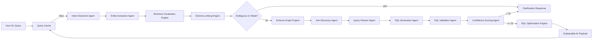

# Enterprise SQL Copilot Architecture

## Folder Structure

```text
backend/
  app.py                    # Flask API integration, schema loader, SQL endpoint, metrics
  main.py                   # ASGI entrypoint
  data/RAG_DOC.xlsx         # schema workbook
  static/index.html         # legacy UI served at /legacy only
frontend/
  app/                      # Next.js 15 route architecture
  components/               # app shell, copilot, dashboard, schema, UI primitives
  features/                 # typed API client, Zustand stores, demo fallback data
agentic/
  enterprise_copilot.py      # schema graph, intent, linking, planning, SQL, validation, cache, XAI
  manager.py                 # existing RL orchestration layer
docs/
  enterprise_sql_copilot.md  # backend agent architecture and migration notes
tests/
  test_enterprise_copilot.py # focused local agent tests
main.py                      # compatibility shim for uvicorn main:asgi_app
```

## Architecture Diagram



## Implemented Modules

- `SchemaGraphEngine`: builds a table/column graph, stores inferred FK edges, exposes shortest join paths, relationship maps, and Mermaid ER output.
- `IntentDetectionAgent`: detects select, count, sum, avg, group by, order by, filters, joins, and limit.
- `EntityExtractionAgent`: extracts raw and canonical terms, measures, and enum filters.
- `BusinessVocabularyEngine`: maps business terms like employee/staff, client/customer, invoice/bill, salary/pay/compensation and loads persisted learned mappings.
- `SchemaLinkingEngine`: ranks table/column matches with token scoring and RapidFuzz when installed; rejects unresolved compensation terms.
- `JoinDiscoveryAgent`: uses BFS over the schema graph for multi-hop joins.
- `QueryPlannerAgent`: creates a validated plan before SQL generation.
- `SQLGenerationAgent`: generates SQL only from the plan.
- `SQLValidationAgent`: calls the existing parser/validator and checks intent requirements.
- `ConfidenceScoringAgent`: blocks execution below 70.
- `SQLOptimizationEngine`: flags `SELECT *` and suggests join/filter indexes.
- `QueryCacheLayer`: persists successful NL to SQL mappings.
- `ER Diagram Generator`: exposed at `/schema/er`.

## Integration Strategy

The existing `/sql` endpoint is unchanged. When remote LLMs are disabled, `generate_sql()` calls `EnterpriseSQLCopilot.run()` instead of old single-template fallbacks. The response still returns `sql` and `insights`, but `insights` now includes intent JSON, entities, selected tables, join path, plan, confidence, cache status, optimizations, and clarification options.

Backend endpoints consumed by the Next frontend:

```text
GET /health
POST /sql
GET /schema/relationships
GET /schema/er
GET /metrics
```

## Current Correct Behavior

`Show top 5 highest paid employees` does not generate fake SQL because the schema has no employee salary/compensation column. It returns clarification with confidence 25 and asks to map `salary/pay/compensation` to a real column. If you later add `employees.annual_ctc` or persist a learned mapping, the planner can safely use it.

## Testing Strategy

- Unit test each agent with synthetic schemas.
- Regression-test common NL queries: filters, counts, group by, joins, order by, and limits.
- Add negative tests for missing business terms and ambiguous columns.
- Keep SQL parser validation tests for unknown tables, unknown columns, and blocked DML/DDL.
- Add endpoint smoke tests for `/sql`, `/schema/relationships`, and `/schema/er`.

Run:

```bash
python -m pytest tests
```

## Performance Strategy

- Cache successful NL to SQL mappings in SQLite.
- Keep schema graph in memory after startup.
- Use BM25/TF-IDF style keyword retrieval before graph planning to reduce candidate objects.
- Use shortest path join discovery instead of brute-force join enumeration.
- Persist learned mappings so repeated corrections do not require re-ranking.

## Migration Strategy

1. Keep backend APIs under `backend/` and expose ASGI through `backend.main`.
2. Keep root `main.py` as a compatibility shim.
3. Route LLM-free generation through `EnterpriseSQLCopilot`.
4. Serve the old HTML only from `/legacy`; the Next.js app is the primary UI.
5. Backfill learned mappings from known business terms only after matching columns exist.
6. Add a dedicated execution endpoint before enabling live query execution from the frontend.
