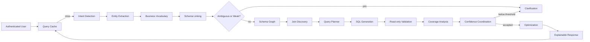

# Enterprise SQL Copilot Architecture

## System Map

```text
browser
  -> Next.js middleware and AuthProvider
  -> Flask session, CSRF, and role boundary
  -> enterprise SQL agent pipeline
  -> read-only validation and explainability
  -> typed frontend views
```


```mermaid
flowchart LR
  U[Authenticated User] --> C[Query Cache]
  C -->|miss| I[Intent Detection]
  I --> E[Entity Extraction]
  E --> V[Business Vocabulary]
  V --> L[Schema Linking]
  L --> A{Ambiguous or Weak?}
  A -->|yes| Q[Clarification]
  A -->|no| G[Schema Graph]
  G --> J[Join Discovery]
  J --> P[Query Planner]
  P --> S[SQL Generation]
  S --> X[Read-only Validation]
  X --> K[Coverage Analysis]
  K --> F[Confidence Coordination]
  F -->|below threshold| Q
  F -->|accepted| O[Optimization]
  O --> R[Explainable Response]
  R --> C
```

## Repository Modules

```text
backend/
  app.py                         API, policy boundary, orchestration
  auth.py                        identity, sessions, resets, logs
  synthetic_enterprise_data.py  virtual catalog and schema governance
agentic/
  enterprise_copilot.py          pipeline coordinator
  planner_agents.py              plan construction and checks
  coverage_agents.py             semantic result coverage
  confidence_coordinator.py      confidence evidence and gating
  display_resolver.py            user-facing column resolution
  aggregation_semantic.py        aggregation intent semantics
frontend/
  app/                            auth and workspace routes
  components/                     shell, chat, dashboards, schema, UI
  features/                       typed API, auth, persistent UI state
tests/
  test_enterprise_copilot.py
  test_auth.py
  test_coverage_agents.py
  test_confidence_thresholds.py
  test_aggregation_equivalence.py
  test_alias_resolution.py
  test_display_column_validation.py
```

## Agent Responsibilities

- Intent Detection identifies selection, counts, aggregates, grouping, ordering, filters, joins, and limits.
- Entity Extraction separates raw terms, canonical terms, measures, dimensions, and enum filters.
- Business Vocabulary maps approved business language to real schema concepts.
- Schema Linking ranks table and column candidates and rejects unresolved concepts.
- Schema Graph and Join Discovery find valid direct and multi-hop paths.
- Query Planner builds a structured plan before SQL generation.
- Query Planner uses schema-driven measure, date, dimension, and role-aware join resolvers across supported tables rather than exact prompt-only branches.
- SQL Generation renders only from the accepted plan.
- SQL Validation enforces one read-only `SELECT`, schema validity, and intent requirements.
- Coverage Analysis verifies that requested displays, filters, groups, and aggregates survive into SQL.
- Confidence Coordination combines planner, validator, resolver, and coverage evidence.
- Optimization returns rewritten SQL guidance, explanation, execution plan, estimated cost reduction, and index suggestions.
- Explainability exposes intent, entities, tables, joins, plan, validation, confidence, coverage, runtime counters, and clarification options.

## API Integration

The contract keeps the core endpoint names:

```text
POST /sql
GET  /health
GET  /metrics
GET  /schema/relationships
GET  /schema/er
```

These endpoints are now behind session validation except `/health`. The SQL response continues to return `sql` and `insights`, with optimizer and explainability fields added without removing the existing contract.

The dashboard reads `planner_accuracy`, `sql_accuracy`, `validator_precision`, and `confidence_reliability` from `/metrics`. Planner, Optimizer, Explainable AI, and Execution reuse the active Copilot result instead of issuing duplicate SQL requests.

Dashboard trend points also expose per-query confidence, planner, validator, intent, and join scores. The frontend recalculates quality cards, success rate, latency, and recent activity for the selected time window and refreshes metrics every 10 seconds.

The suggestion strip remains diverse after each query: up to two prompts come from the latest tables and the remaining prompts continue to cover HR, Finance, Projects, Operations, and Analytics.

Explainable AI distinguishes a completed single-table plan from a joined plan or a planner clarification stop. An empty join path no longer means that planning is still pending.

## Query Safety

The validator rejects write, DDL, execution, and privilege operations. Missing or ambiguous business concepts produce clarification instead of fabricated columns. For example, compensation questions remain blocked unless the active schema contains or explicitly maps a compensation field.

Representative generalized queries include:

```text
Invoice amount by month
Running hours by employee each month
Show project budget by client tier
Critical bugs by assignee
Top 10 clients by invoice amount
Deployments this week by environment
Sprints ending this month by project
```

The Execution page is intentionally a preview and export surface. There is no arbitrary database execution route.

## Schema Governance

Authenticated users can submit:

- new table requests
- new schema requests
- business requirements
- CSV uploads
- JSON uploads
- general feedback

Schema requests are owner-scoped. Administrators can review every request and change workflow status. Generated schema suggestions, attachment metadata, ownership, and audit activity are stored in SQLite.

## Performance Model

- Successful natural-language-to-SQL results can be cached.
- The loaded schema graph remains in memory.
- Candidate retrieval narrows schema objects before planning.
- Join discovery uses graph traversal instead of brute-force enumeration.
- Shared frontend result state avoids duplicate generation calls.
- Bounded message and navigation scroll regions prevent document-level layout churn.

## Verification

```powershell
python -m pytest -q
python -m py_compile backend\auth.py backend\app.py backend\synthetic_enterprise_data.py
cd frontend
npm run lint
npm run build
npm run test:e2e
```

The Python suite covers agent semantics, confidence, validation, authentication, CSRF, session revocation, role checks, schema request ownership, and upload metadata. Playwright covers authenticated desktop and mobile workflows against the real API.
