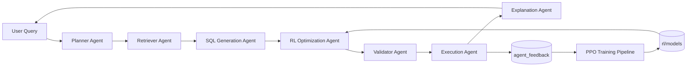

# RL-Enhanced SQL Copilot Architecture



## Workflow

1. The existing RAG pipeline retrieves schema context and generates candidate SQL.
2. `SQLQueryOptimizationEnv` wraps query state, actions, execution metadata, validation, and reward shaping.
3. PPO can learn which optimization action to apply: regenerate SQL, modify joins, modify filters, modify aggregation, or keep the query.
4. Every execution can write feedback into the `agent_feedback` SQLite table.
5. The dashboard reads that feedback table to show reward, success rate, latency, and trends.

## Commands

Install optional RL dependencies:

```bash
pip install gymnasium stable-baselines3 plotly pytest
```

Train:

```bash
python -m rl.training.train --db-path your.sqlite --timesteps 10000
```

Evaluate:

```bash
python -m rl.evaluation.evaluate --model-path rl/models/sql_ppo_agent.zip --db-path your.sqlite
```

