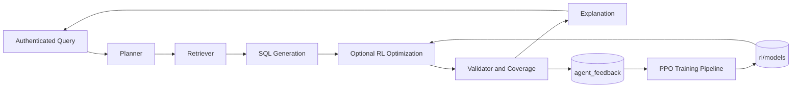

# RL-Enhanced SQL Copilot Architecture


```mermaid
flowchart LR
    U[Authenticated Query] --> P[Planner]
    P --> R[Retriever]
    R --> G[SQL Generation]
    G --> O[Optional RL Optimization]
    O --> V[Validator and Coverage]
    V --> X[Explanation]
    X --> U
    V --> F[(agent_feedback)]
    F --> T[PPO Training Pipeline]
    T --> M[(rl/models)]
    M --> O
```

## Runtime Workflow

1. The authenticated `/sql` route sends the user query through schema retrieval and deterministic planning.
2. `SQLQueryOptimizationEnv` can wrap query state, candidate actions, validation metadata, and reward shaping.
3. PPO can select regeneration, join modification, filter modification, aggregation modification, or no change.
4. Validation and semantic coverage remain mandatory after any optimization.
5. Agent outcomes can be written to the `agent_feedback` SQLite table.
6. `/metrics` converts stored outcomes into dashboard quality and operational signals.

RL does not bypass authentication, CSRF, SQL validation, coverage checks, or confidence gating.

## Storage Separation

`AGENT_FEEDBACK_DB_PATH` defaults to `backend/sql_agent_feedback.sqlite` and contains model feedback and telemetry.

`AUTH_DB_PATH` defaults to `backend/sql_copilot.db` and contains users, sessions, product feedback, schema requests, and structured application logs.

Keeping these concerns separate allows model-training data to be retained or rotated independently from identity data.

## Dashboard Integration

The protected dashboard consumes `GET /metrics` and displays:

- Planner Accuracy
- SQL Accuracy
- Validator Precision
- Confidence Reliability
- average reward
- query success rate
- average latency
- real per-query confidence, planner, and validator trends
- schema request activity

Each metric event combines execution feedback with the matching planner telemetry. Reward remains an RL signal and is not converted into confidence. The UI supports Day, Week, Month, Quarter, and Year filters; recalculates KPIs, success rate, latency, and recent activity from the selected events; refreshes every 10 seconds; and provides explicit loading, empty, error, and retry states.

## Commands

Install optional RL dependencies:

```powershell
pip install -r backend\requirements-rl.txt
```

Train:

```powershell
python -m rl.training.train --db-path your.sqlite --timesteps 10000
```

Evaluate:

```powershell
python -m rl.evaluation.evaluate --model-path rl/models/sql_ppo_agent.zip --db-path your.sqlite
```

Run the non-RL regression suite:

```powershell
python -m pytest -q
```

## Operational Boundaries

RL dependencies and a trained model are optional. If they are unavailable, the deterministic planner, validator, coverage, and confidence pipeline remains active. Model promotion should use offline benchmark results and must preserve the read-only SQL policy.
